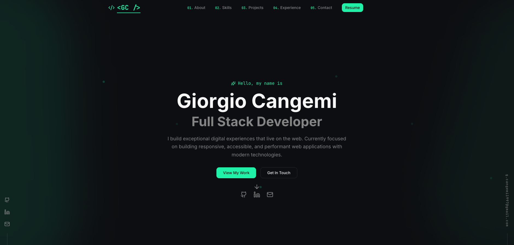

# 🌐 GC Portfolio

<p align="center">
  
  
  
  
  
  
  
</p>

<p align="center">
  <strong>Personal developer portfolio of Giorgio Cangemi — Full Stack Developer based in Palermo, Italy.</strong><br />
  Built with Next.js 16, React 19, TypeScript, Tailwind CSS v4, and Framer Motion.
</p>

***

## 📌 Overview

This is my personal portfolio website, designed and developed from scratch to present my skills, projects, and professional background as a full-stack web developer.

The goal was to create a clean, modern, fully animated, and accessible interface — a professional online presence for recruiters and fellow developers.

***

## 🖼️ Preview



***

## 🌐 Live Demo

- **Portfolio:** https://gc-portfolio-eta.vercel.app/
- **Repository:** https://github.com/gcangemi1997-coder/GC-portfolio

***

## ✨ Sections

The portfolio is structured into the following sections:

| Section | Description |
|---------|-------------|
| 🦸 **Hero** | Introduction, title, and CTA |
| 👤 **About** | Personal background and developer profile |
| 🛠️ **Skills** | Technologies and tools |
| 💼 **Projects** | Featured personal and training projects |
| 📅 **Experience** | Education and learning journey |
| 📬 **Contact** | Contact form and social links |
| 🔗 **Footer** | Links and copyright |

***

## 🧰 Tech Stack

| Category | Technology |
|----------|------------|
| Framework | Next.js 16 |
| Library | React 19 |
| Language | TypeScript |
| Styling | Tailwind CSS v4 |
| Animations | Framer Motion |
| UI Components | Radix UI, shadcn/ui |
| Form Handling | React Hook Form + Zod |
| Icons | Lucide React |
| Theme | next-themes (dark/light mode) |
| Analytics | Vercel Analytics |
| Package Manager | pnpm |
| Deployment | Vercel |

***

## 🏷️ Skills Badges

### Core Stack


### Styling


### Libraries & Tools


### Dev & Deployment


***

## 🏗️ Project Structure

```bash
GC-portfolio/
├── app/                      # Next.js App Router (pages and layouts)
├── components/
│   ├── portfolio/            # Portfolio sections
│   │   ├── hero.tsx
│   │   ├── about.tsx
│   │   ├── skills.tsx
│   │   ├── projects.tsx
│   │   ├── experience.tsx
│   │   ├── contact.tsx
│   │   ├── header.tsx
│   │   └── footer.tsx
│   ├── ui/                   # shadcn/ui components
│   └── theme-provider.tsx
├── hooks/                    # Custom React hooks
├── lib/                      # Utility functions
├── public/                   # Static assets
├── styles/                   # Global styles
├── components.json           # shadcn/ui config
├── next.config.mjs
├── postcss.config.mjs
├── tailwind.config
├── tsconfig.json
└── package.json
```

***

## 🚀 Getting Started

### 1. Clone the repository

```bash
git clone https://github.com/gcangemi1997-coder/GC-portfolio.git
```

### 2. Move into the project folder

```bash
cd GC-portfolio
```

### 3. Install dependencies

```bash
pnpm install
```

### 4. Start the development server

```bash
pnpm dev
```

Open [http://localhost:3000](http://localhost:3000) in your browser.

***

## 🎯 What This Portfolio Demonstrates

- Component-based architecture with Next.js App Router
- Advanced TypeScript usage across the entire codebase
- Smooth animations with Framer Motion
- Accessible and composable UI via Radix UI and shadcn/ui
- Clean form handling with React Hook Form and Zod validation
- Dark/light mode theming with next-themes
- Responsive design with Tailwind CSS v4
- Analytics integration via Vercel Analytics

***

## 📖 What I Practiced

- Next.js 16 App Router structure
- TypeScript with React components
- Tailwind CSS v4 with custom design tokens
- Animation patterns with Framer Motion
- Building accessible UI components
- Deployment and CI on Vercel

***

## 📫 Contact

- **GitHub:** [gcangemi1997-coder](https://github.com/gcangemi1997-coder)
- **LinkedIn:** https://www.linkedin.com/in/giorgio-cangemi-7b4b77172/
- **Email:** g.cangemi1997@gmail.com

***

## ⭐ Support

If you like this project, feel free to leave a star on the repository!
